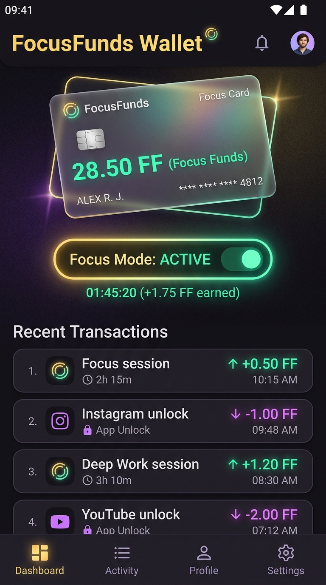
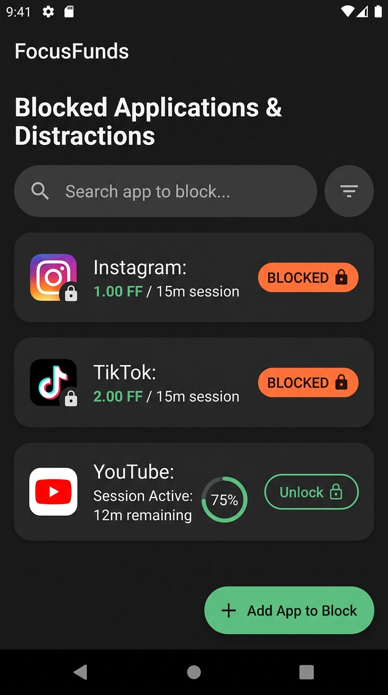
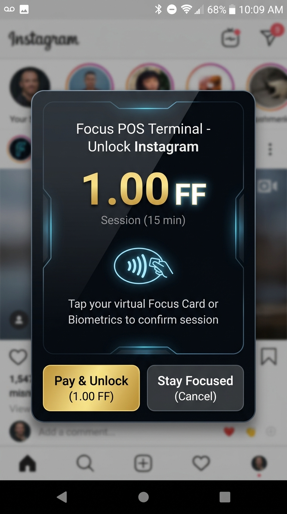

<div align="center">

  # FocusFunds 💳⏳
  ### *Gamified Digital Wellbeing & Screen-Time Economy for Android*

  [](https://android.com)
  [](https://kotlinlang.org)
  [](https://developer.android.com/jetpack/compose)
  [](https://developer.android.com/training/data-storage/room)
  [](LICENSE)

  <p align="center">
    <b>Turn your focus into currency and stop endless doomscrolling.</b><br>
    FocusFunds turns your screen time into a virtual micro-economy: earn <b>Focus Funds (FF)</b> by working productively, and spend your hard-earned funds at a virtual POS terminal whenever you want to unlock distracting apps.
  </p>

</div>

---

## 📱 App Screenshots

<div align="center">
  <table>
    <tr>
      <td align="center" width="33%">
        <b>💳 FocusFunds Wallet & Focus Mode</b><br><br>
        <br><br>
        <em>Holographic virtual Focus Card, active timer earning FF, and recent transaction ledger.</em>
      </td>
      <td align="center" width="33%">
        <b>🔒 Distraction & App Blocker</b><br><br>
        <br><br>
        <em>Configurable blocked applications with session costs (FF / 15m) and status trackers.</em>
      </td>
      <td align="center" width="33%">
        <b>🏧 Focus POS Payment Terminal</b><br><br>
        <br><br>
        <em>System overlay prompt requiring a virtual card tap or biometric authorization to unlock.</em>
      </td>
    </tr>
  </table>
</div>

---

## 🌟 Key Features

### ⏳ 1. Earn Focus Funds by Staying Productive
* **Focus Timer:** Activate **Focus Mode** to start accumulating virtual Focus Funds (FF) over time.
* **Reward Multipliers:** Earn bonuses for extended deep work sessions without interruption.
* **Welcome Bonus:** New users start with 5.00 FF to bootstrap their productivity economy.

### 💳 2. Virtual POS Terminal & Card Payment Simulation
* **Contactless Card Tap Overlay:** When opening a restricted app (e.g., Instagram, TikTok, YouTube), a sleek frosted-glass **POS terminal overlay** intercepts the launch.
* **Conscious Friction:** To proceed, you must consciously "pay" the required FF cost using your virtual card balance or biometric confirmation.
* **Timed Sessions:** Unlocks are granted for temporary time-boxes (*e.g., 15 minutes*), automatically re-locking the app once time expires.

### 🛡️ 3. Robust App Blocking & Accessibility Service
* **Zero-Bypass Architecture:** Powered by an Android `AccessibilityService` that detects foreground window changes in real-time.
* **Emergency Unlocks:** Option to trigger an emergency unblock with penalty deductions recorded on the ledger.
* **Custom Blocklist:** Search and toggle blocking for any installed application on the device.

### 📊 4. Full Financial Ledger & Transaction History
* **Audited Transactions:** Every earned token, app unlock, and penalty is stored in a local SQLite/Room database.
* **Detailed Logs:** Track session start times, package names unlocked, amounts paid, and remaining balances.

---

## 🏗️ Technical Architecture & Stack

```
app/src/main/java/com/focusfunds/app/
├── data/                       # Room Database & Persistence Layer
│   ├── Daos.kt                 # DAOs for Wallet, BlockedApps, Sessions, Transactions
│   ├── Entities.kt             # Room Data Entities
│   ├── FocusFundsDatabase.kt   # Database builder and migrations
│   └── FocusFundsRepository.kt # Central repository providing Flow streams
├── service/                    # Background Services & Interceptors
│   ├── AppBlockAccessibilityService.kt # Real-time app launch detection
│   ├── FocusForegroundService.kt       # Persistent focus timer service
│   └── ServiceLifecycleHelper.kt       # Lifecycle and auto-restart management
└── ui/                         # UI Components & Overlay
    ├── MainActivity.kt         # Jetpack Compose dashboard & navigation
    ├── POSOverlayView.kt       # Native window overlay for payment authorization
    └── theme/                  # Material 3 Dark theme & holographic styling
```

---

## 🚀 Getting Started

### Prerequisites
* [Android Studio](https://developer.android.com/studio) Hedgehog or newer
* JDK 17+
* Android SDK (API Level 26+ / Android 8.0 Oreo minimum)

### Build & Run

1. **Clone the repository:**
   ```bash
   git clone https://github.com/RobFalc99/focusfunds.git
   cd focusfunds
   ```

2. **Open in Android Studio** or build via Gradle wrapper:
   ```bash
   ./gradlew assembleDebug
   ```

3. **Install on device:**
   ```bash
   ./gradlew installDebug
   ```

---

## 🛡️ Required Android Permissions

* `SYSTEM_ALERT_WINDOW`: Required to display the POS payment terminal overlay on top of distracting applications.
* `BIND_ACCESSIBILITY_SERVICE`: Used strictly to detect when a blacklisted application is brought to the foreground.
* `FOREGROUND_SERVICE`: Keeps the focus mode timer active reliably in the background.
* `POST_NOTIFICATIONS`: For ongoing focus session progress and balance alerts.

---

## 📄 License

This project is licensed under the **MIT License**. See the `LICENSE` file for details.

---

<div align="center">
  Crafted with passion for mindful productivity by <b>Roberto Falcone</b> 🧠✨
</div>
